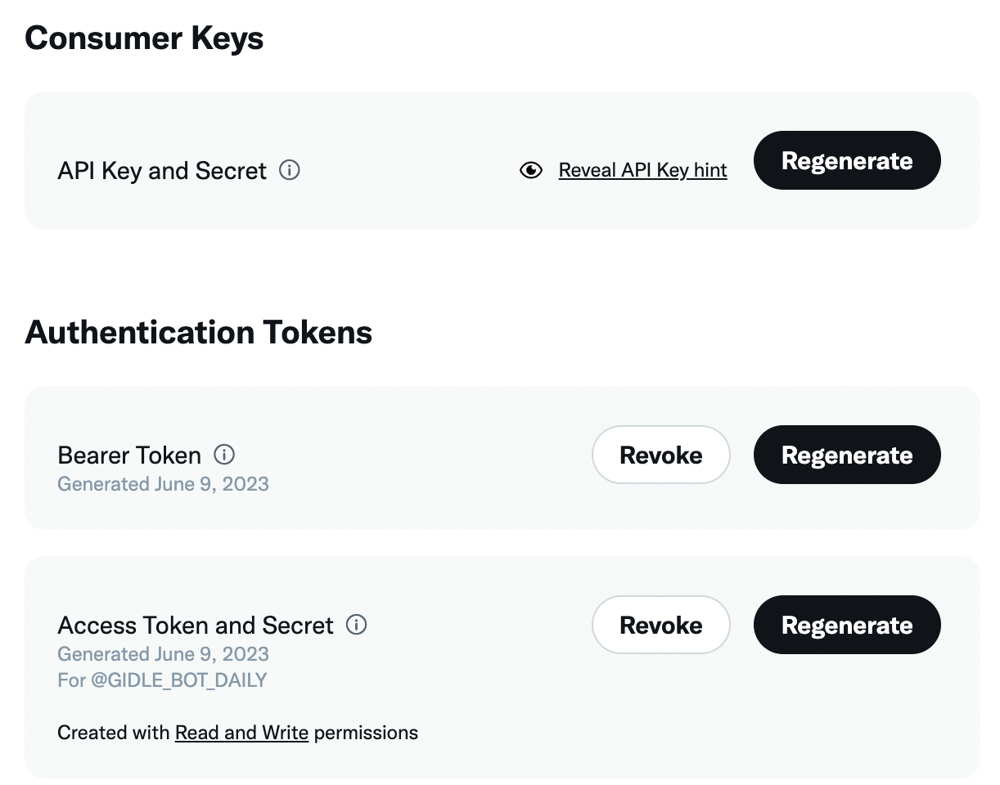
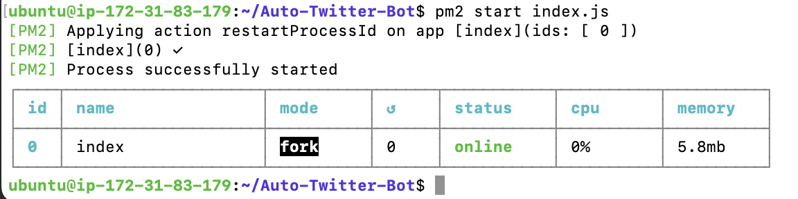

# Auto-Twitter-Bot
This is a bot that will automatically post a (G)I-DLE picture once every 4 hours. [@GIDLE_BOT_DAILY](https://twitter.com/GIDLE_BOT_DAILY)

## Twitter Developer Account
- Be sure to have a Twitter developer account ready. [Here](https://developer.twitter.com/en/portal/dashboard)

- We need Consumer Keys (API Keys, Serect) and Authentication Tokens (Access Token and Secret).
 Keep them in a safe place and not reveal to others.

## Dependencies
- Check if you have Node.js and npm installed in your PC
`node -v` and `npm -v`.

- Download the necessary components
```
npm init -y
npm install twitter-api-v2
npm install dotenv
npm install cron
npm install fs
npm install request
npm install sharp
```

- Create a `.env` file and replace your values you created on the Twitter developer platform. Note that APP_ID is the first few numbers of ACCESS_TOKEN
```
NODE_ENV="development"
API_KEY = "XXXXXX"
API_SECRET = "YYYYYY"
ACCESS_TOKEN = "12345-ZZZZ"
ACCESS_SECRET = "WWWWWWW"
BEARER_TOKEN = "AAAAAAA"
APP_ID = "12345"
```
- You can also include the Instagram API key in `.env` file.
```
IG_USERNAME="WWWWWWW"
IG_PASSWORD="ZZZZZZ"
```

- You have to create a `.gitignore` file to hide these sensitive values from other people.

## Environment
- I don't want to set up the Twitter bot locally, so I build a Linux environment inside a EC2 instance of AWS (free tier, free for the first year).

- I use pm2 to keep my `index.js` running. By default, pm2 will keep the process running even after disconnecting from the SSH session. 

You can download it by typing `sudo npm install -g pm2` in the terminal.

## Limitations and Others
- I still have to manually filter the image and add the image direct link to a JSON file.

- I used the free Twitter API v2, so I don't have the access of retweet a post, like a post, search a post etc. 

- ~~I used igmur as my storage to keep all my images online.~~ 

- I directly used one Github repository to store my images.

- I was also trying to implement a Instagram Bot that will do the same thing. However, I could only do it locally, not on the remote server :(
There were some errors using the `sharp` module.

- Due to the small capacity of the remote server, I cannot a build system like Docker to ensure consistency between environments.

- I used the `postRecord.txt` file to keep track of the images that have been tweeted. I created a bash script that make my life easier. Don't forget to make it executable, `chmod u+x twitter.sh`.
```
ubuntu@ip-172-31-83-179:~$ cat twitter.sh 
#!/bin/sh

cp Auto-Twitter-Bot/postRecord.txt .
cd Auto-Twitter-Bot
pm2 stop 0
git pull
pm2 start index.js
```

## License and Credits
MIT License. Inspired by the Twitter Bot tutorial from [Ryan Carmody](https://www.ryancarmody.dev/about)
