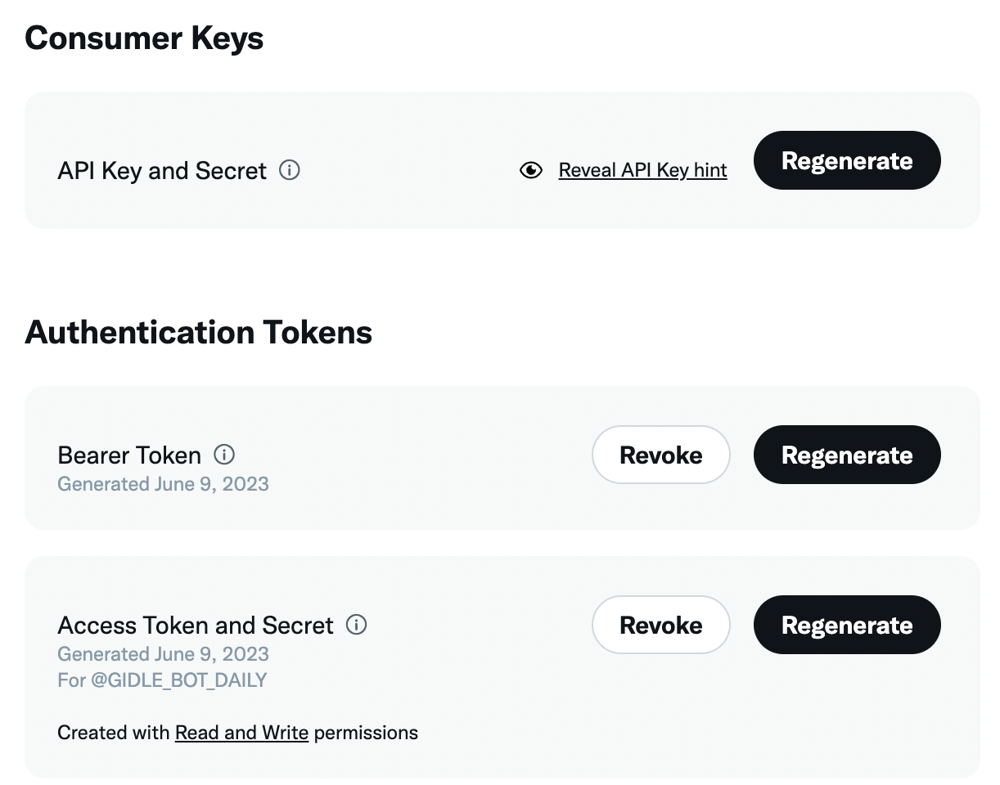
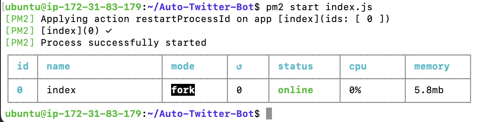

# Auto-Twitter-Bluesky-Mastodon-Bots

This is a bot that will automatically post a set of (G)I-DLE pictures once every 8 hours, cross-posted to [**Twitter/X**](https://twitter.com/GIDLE_BOT_DAILY), [**Bluesky**](https://bsky.app/profile/gidle-bot-daily.bsky.social), and [**Mastodon**](https://mastodon.social/@GIDLE_BOT_DAILY).


## Twitter Developer Account

- Be sure to have a Twitter developer account ready. [Here](https://developer.twitter.com/en/portal/dashboard)

- We need Consumer Keys (API Keys, Secret) and Authentication Tokens (Access Token and Secret).
   Keep them in a safe place and not reveal to others.

- **Note (2026):** X discontinued the old Free/Basic/Pro tiers in favor of a pay-per-use, credit-based model. Posting a text/media tweet without a URL costs roughly $0.015 per request. For a bot posting a handful of tweets a day, this typically runs a few dollars a month — check your app's **Usage analytics** page on the developer dashboard to see your actual cost and confirm your app is showing under "Pay Per Use."

## Bluesky Account

- Create a Bluesky account, then generate an **App Password** under Settings → Privacy and Security → App Passwords. Don't use your main login password — the App Password can be revoked independently if it ever leaks.

- Bluesky is currently free to use (with rate limits), no developer approval process required.

## Mastodon Account

- Create an account on the Mastodon instance of your choice (e.g. `mastodon.social`). Note the instance domain — you'll need it as the API base URL.

- Under Preferences → Development, create a New Application. The `write` scope is enough for posting text + media; you can skip `read`, `profile`, and `follow` if you want to keep permissions minimal.

- This will give you a Client key, Client secret, and an **Access Token** — only the Access Token is needed for posting.

## Dependencies

- Check if you have Node.js and npm installed in your PC
  `node -v` and `npm -v`.

- **Node.js v20.10 or newer is required.** The Bluesky SDK (`@atproto/api`) is published as an ESM-only package and uses `import ... with { type: 'json' }` syntax that older Node versions can't parse — you'll get a cryptic `Unexpected token 'with'` error if you're on an older version. If you're using `nvm`, run `nvm install --lts` and `nvm use --lts` before installing dependencies.

- Download the necessary components

```
npm init -y
npm install twitter-api-v2
npm install dotenv
npm install cron
npm install fs
npm install request
npm install sharp
npm install @atproto/api
```

- Mastodon posting uses Node's built-in `fetch`/`FormData` — no extra package needed on Node 18+.

- Create a `.env` file and replace your values you created on the Twitter developer platform. Note that APP_ID is the first few numbers of ACCESS_TOKEN

```
NODE_ENV="development"
API_KEY = "XXXXXX"
API_SECRET = "YYYYYY"
ACCESS_TOKEN = "12345-ZZZZ"
ACCESS_SECRET = "WWWWWWW"
BEARER_TOKEN = "AAAAAAA"
APP_ID = "12345"

BSKY_HANDLE = "yourname.bsky.social"
BSKY_APP_PASSWORD = "xxxx-xxxx-xxxx-xxxx"

MASTODON_API_URL = "https://mastodon.social"
MASTODON_ACCESS_TOKEN = "XXXXXXXXXXXXXXXX"
```

- If you don't want to create a Instagram Bot, you don't have to install the following.

```
npm install instagram-private-api
npm install request-promise
npm install jimp
```

- Be sure also include the Instagram API key in `.env` file.

```
IG_USERNAME="WWWWWWW"
IG_PASSWORD="ZZZZZZ"
```

- You have to create a `.gitignore` file to hide these sensitive values from other people. Make sure runtime state files (`posting_history.json`, `postRecord.txt`) and the `img/` download cache are also ignored — these shouldn't be tracked in version control, since the bot rewrites them constantly and tracking them tends to cause merge conflicts on deploy.

## Environment

- I don't want to set up the Twitter bot locally, so I build a Linux environment inside a EC2 instance of AWS (free tier, free for the first year).

- I use pm2 to keep my `index.js` running. By default, pm2 will keep the process running even after disconnecting from the SSH session.
  
  You can download it by typing `sudo npm install -g pm2` in the terminal.

- Since GitHub no longer supports password authentication for git operations, set up a Personal Access Token (Settings → Developer settings → Personal access tokens) and run `git config --global credential.helper store` on the server so `git pull`/`git push` don't prompt for credentials every time the deploy script runs.

## Limitations and Others

- I still have to manually filter the image and add the image direct link to a JSON file. Updating `uris.json` and redeploying automatically picks up newly added images — already-posted images are tracked separately and won't repeat.

- I used the free Twitter API v2, so I don't have the access of retweet a post, like a post, search a post etc. As of 2026, X has moved to pay-per-use pricing entirely, so even posting now has a small per-request cost (see above).

- I directly used one Github repository to store my images.

- Due to the small capacity of the remote server, I cannot a build system like Docker to ensure consistency between environments.

- I used the `postRecord.txt` file to keep track of the images that have been posted. I created a bash script that makes my life easier. Don't forget to make it executable, `chmod u+x twitter.sh`.

- I used a in-memory set and `posting_history.json` to ensure all posted images are unique. Once the entire image pool has been posted once, the bot wipes both the in-memory set and `postRecord.txt` and starts a fresh cycle automatically.

- The bot posts multiple images at once based on a pre-set probability distribution across 4 modes (1–4 images per post).

- Bluesky requires a `RichText` facet to make `#hashtags` clickable — just posting plain text with a `#` in it renders as static text, unlike Twitter and Mastodon which auto-link hashtags server-side.

- Each platform posting call (`postToBluesky`, `postToMastodon`) is wrapped in its own `try/catch`, so if one platform's API has a hiccup, it doesn't take down the whole bot or the other platforms.

- Special occasion posts (member birthdays and group debut anniversary) are handled in `birthdayPost.js`, which fires daily at KST 00:00. Each event posts a multilingual message with up to 3 randomly selected images from `special_uris.json`. If no images are available for a given occasion, it falls back to text-only automatically.

- X posts for birthdays/anniversary are text-only to avoid the $0.20/post URL surcharge — cross-platform links are included in Bluesky and Mastodon posts only.

```
#!/bin/sh

cd Auto-Twitter-Bot
git pull
pm2 restart index

cd img
rm -f ./*
```

- To add new images to the regular pool, update `uris.json` and run `twitter.sh`. To add or update special occasion images (birthdays/anniversary), update `special_uris.json` in the same way — both files are tracked in git so a single `git push` + `twitter.sh` keeps the server in sync.

## License

MIT License.
